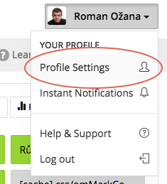
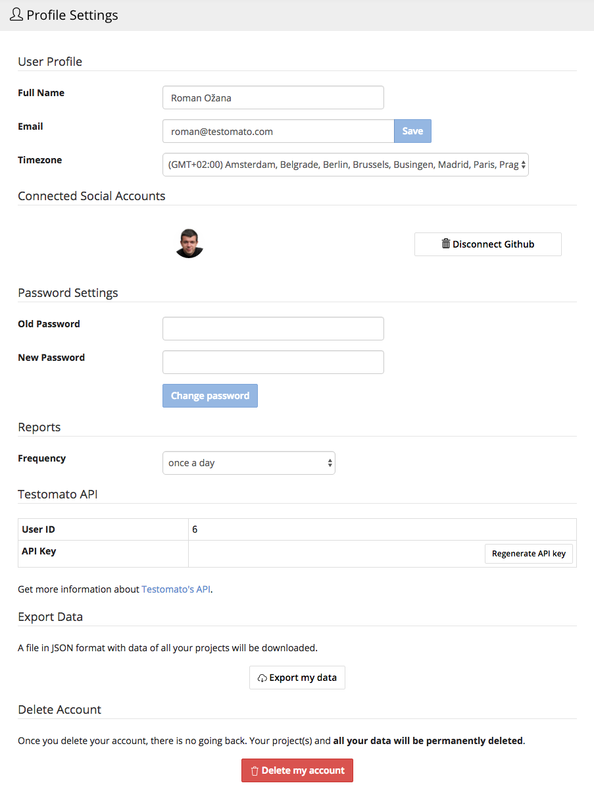

Profile Settings
================

First, you'll need to go to the account menu (located in the top right corner)
and select `Profile Settings <https://www.testomato.com/user/profile>`_:

From your profile Settings page, you can:

* Enter your name, email, and timezone.
* Change your password.
* Choose how often you would like to receive :doc:`Reports </reports/reports>` from Testomato.
* View or regenerate users API Key.
* Export all your data.
* Delete your account permanently.

