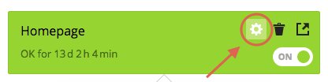
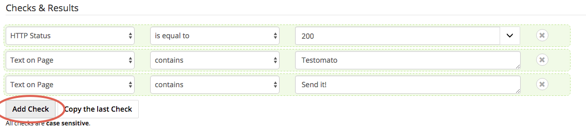

Add new Check
=============

1. Click on the project you'd like to manage.

2. :doc:`Add new Page </pages/add>` or choose existing Page.

3. Chose existing Page or create new Page test, then click on the **Configure checks** button.

4. Scroll down to **Check & Results** section and click on the **Add Check** button.

