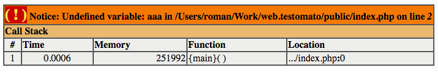
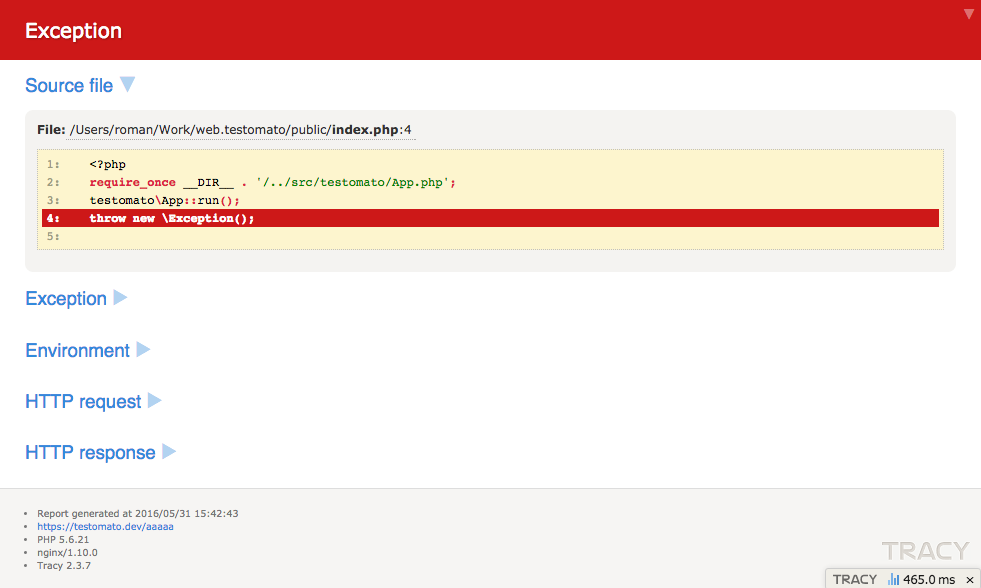
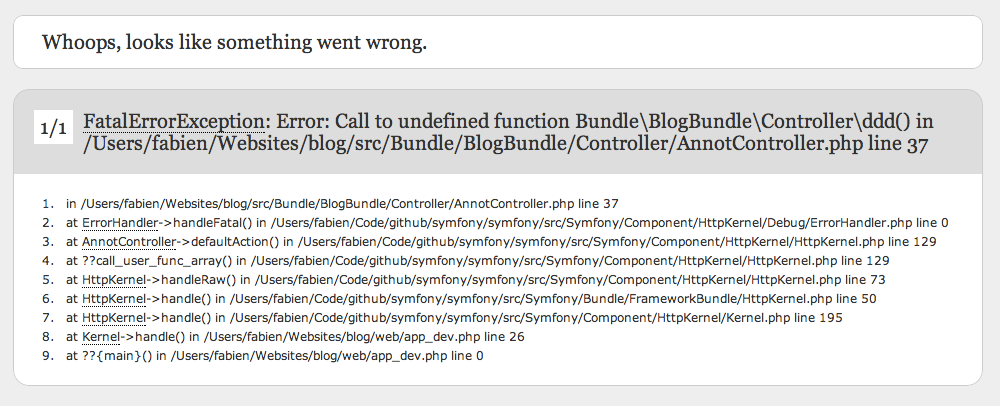

Common Server Error Messages
============================

Testomato is sensitive to follow **Common Error Messages**, they are marker for us,
that something is broken on website.

PHP Errors
----------

Testomato is sensitive to **all types of PHP error messages**:

* :code:`Fatal error`
* :code:`Catchable fatal error`
* :code:`Warning`
* :code:`Parse error`,
* :code:`Notice`
* :code:`Strict Standards`
* :code:`Deprecated`,
* :code:`Unknown error`

Database Errors
---------------

* `All MySQL error messages <https://dev.mysql.com/doc/refman/5.5/en/error-messages-server.html>`_
* Database connection errors:
   * :code:`The server encountered an internal error`
   * :code:`Internal server error`
   * :code:`Can't connect to MySQL server`
   * Nette :code:`Your browser sent a request that this server could not understand or process`
   * Wordpress :code:`Error establishing a database connection`

PHP Debuggers outputs
---------------------

XDebug
~~~~~~

   `XDebug output <https://xdebug.org/>`_ example.

Tracy
~~~~~

   `Nette/Tracy <https://github.com/nette/tracy>`_ bluescreen example

Symfony
~~~~~~~

   `Symfony <https://symfony.com/>`_ error pages example

Others
------

* `Phusion Passenger <https://www.phusionpassenger.com/>`_ errors
* Blank page (page without content)

.. note:: We have an example page generate randomly some of common error messages: https://www.testomato.com/example/error.php
