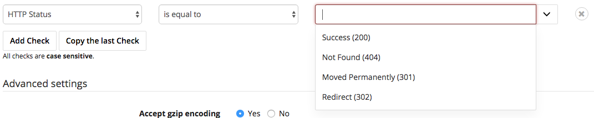

HTTP Status Codes Checks
========================

* 200 OK
* 301 Moved Permanently
* 302 Found
* 303 See Other
* 307 Temporary Redirect
* 403 Forbidden
* 404 Not Found
* 405 Method Not Allowed
* 500 Internal Server Error
* 501 Implemented
* custom status code

Get more information about `HTTPS Status Codes <https://en.wikipedia.org/wiki/List_of_HTTP_status_codes>`_.
