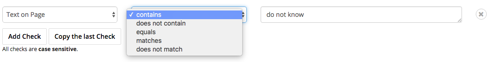

What Are Checks?
===============

With Testomato, you can check your page content for the following:

Other Ways to Use checks
------------------------

* Text on page
* HTML on page
* HTTP header content

.. note:: These checks are case sensitive, so make sure you PaY ClosE AtTentioN to the text you enter.
