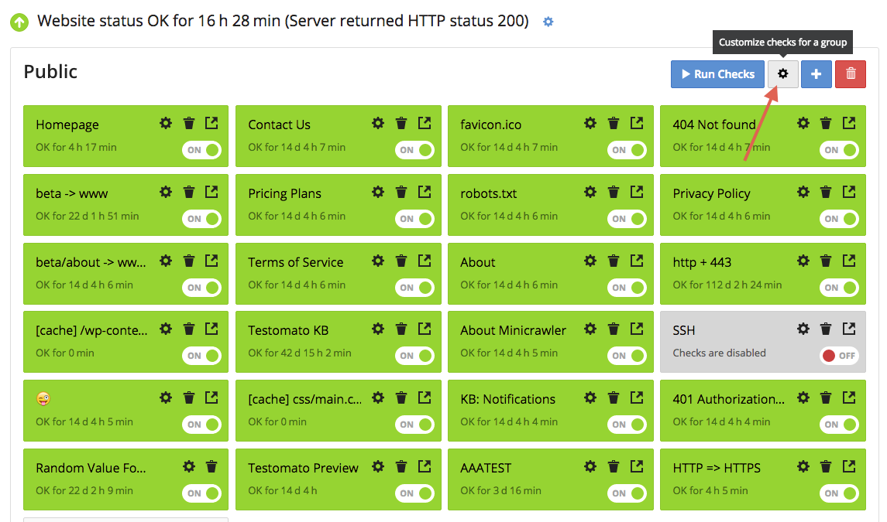

Apply checks to multiple URLs
=============================

Please note that in order to apply rules to more than one URL, you will need to
apply it to a Group of rules. For example, your main dashboard is considered "a group".

Rules for a group of rules will always be applied to the entire group. If you
would like to create a rule that applies to a single check,
:doc:`please visit this article </check/add-check/index>`.

1. Click on the  gear icon at the top-right of your project dashboard.

2. Enter the name of the area (optional) and click  Add rule.

3. Configure :doc:`your check </checks/index>`.

4. Click Add rule to continue adding more rules to the group or click **Save**.
