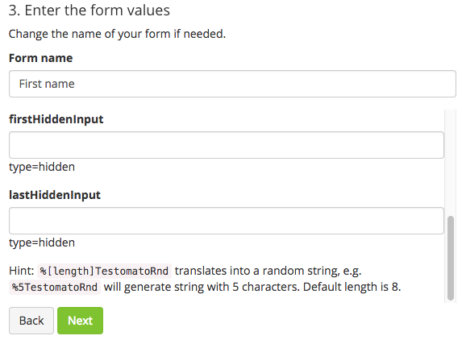
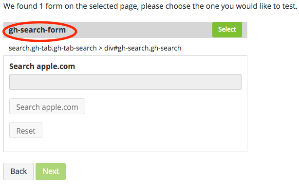

Common Problems with Form Checks
================================

There are a few reasons that a form check may fail in Testomato due to the type
of technology that is used on your website. If you are unable to find any issues
on your website, one of the following technology issues may be interfering with
your configuration.

Technology Issues
-----------------

1. **Your form is generated on the client-side with JavaScript.**

Testomato does not detect client-side generated forms (e.g. Angular JS, ReactJS,
jQuery, JavaScript, etc.). This means we are unable to monitor dynamically
generated forms and pages that are rendered dynamically. We are also unable
to properly test forms, which submit using JavaScript on the client-side.

2. **Your form uses anti-spam protection.**

Testomato does not support checking forms that use CAPTCHA or similar anti-spam
protection.

3. **Your form uses CSRF protection.**

Testomato offers simple CSRF protection for forms. This means that we are only
able to beat CSRF protection if your CSRF token has unlimited validity and the
sessions isn't closed between subsequent checks (i.e. for 5 minutes).

This means that in order for CSRF protection support to work, you'll need to
ensure that the session started when your form was fetched **does not expire**.
Otherwise, your form check will fail. If you need more information about why your
check failed, don't forgot you can view **HTTP response headers** and the
 **HTTP response content**.

Hidden Elements
---------------

Another common problem we see is that users are confused by the forms found by
Testomato during the manual form selection process. Sometimes, a form in the
form selection field may not appear like a form on your website and hidden
form elements will appear in Testomato.

For example, you may see displayed buttons as an input field in the form selection window.

Incorrect Form Selected
-----------------------

Another common problem we see is that a configuration doesn't work because
people have selected the wrong form. Testomato finds and names forms according
to the name or title attribute of a form ( :code:`<form></form>` tags) on your web
page. If Testomato doesn't not find a name or title attribute for your form,
 we use the :code:`<h1></h1>` tags.

This means that you might be asked to select a form, which does not have a
familiar name. In some cases, this can make identifying the correct form difficult.

Here is an example:

If you are having a problem with a auto-generated form, we suggest deleting
the form and trying to add a new form test manually.
