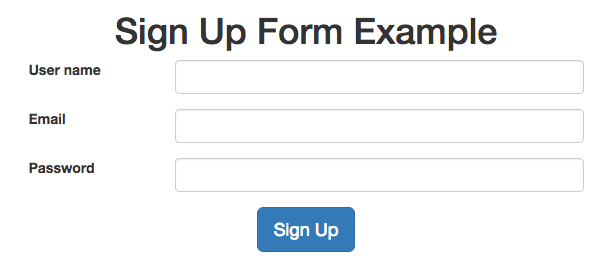
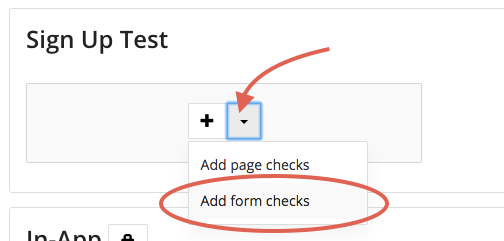

Random Values in Checks
=======================

Random form values allows you to automatically generate email postfixes to avoid
getting a duplicate email error caused by forms that follow a unique email
validation rule. This article will show you how to use random values to
monitor your forms.

.. note:: Many servers (including Gmail) allows you to add a postfix with a plus (+) after a main address.

In other words, testmail+value@testomato.com will send emails to testmail@testomato.com.

You can generate random form values by entering an email like the following
in your form:

.. code-block:: none
 testmail%5TestomatoRnd@testomato.com

Testomato then automatically adds a **5-character** random string after the
main address.

This helps you monitor forms in two ways:

* You can finish your registration process without receiving an error.
* You’ll be able to easily separate your testing account from real user accounts.

How to Register a Random User
~~~~~~~~~~~~~~~~~~~~~~~~~~~~~~

We created a `sample Testomato signup form <https://www.testomato.com/example/signup/>`_
form for this guide that will return a simple green alert when data is sent successfully.

1. Click on the project you'd like to view.

2. Add new :doc:`Form check page </pages/add/index>` and enter the page URL: http://www.testomato.com/example/signup/.

3. Select the form you'd like to configure.

4. Enter your credentials.

.. code-block:: bash

   Login: testmail+%5TestomatoRnd@testomato.com
   Password: mypassword

5. Create a new Rule for text on page contains and type the following string: "New user Elle created".

6. Click Create.

How to Test a Random Login
~~~~~~~~~~~~~~~~~~~~~~~~~~

1. Click on the project you'd like to view.

2. Click Configure form values for the check you’d like to configure.

3. Enter the following data you’d like sent to your form and click  Save.

.. code-block:: none

   login: user%5TestomatoRnd
   password: mypassword

4. Select the box next to My Rules.

5. Enter the expected message you’d like to see. For example, we used the message: “User not found”.

6. Click Save.
