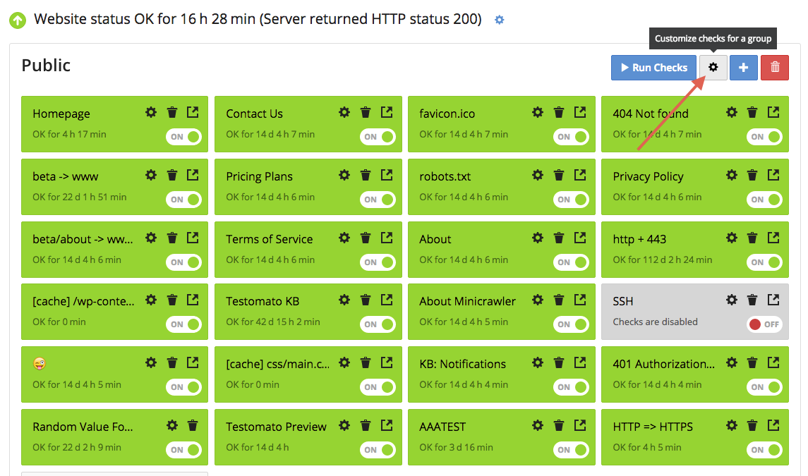

Group settings
==============

1. Click on the project you’d like to view or select.

2. Click on the gear icon at the top-right of your project dashboard.

3. Add or edit some checks that will be applied to the entire group.

4. Change settings and click **Save**.
