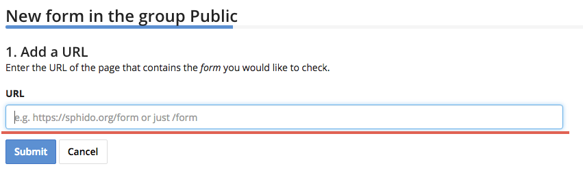

Add a Form Check
================

This article will show you how to check your website forms with Testomato and ensure they're functioning properly.

Form data is monitored using POST commands once checks are configured. In other words, we check forms as if one of your visitors has filled out the form and clicked  Submit.

Testomato tries to auto-detect all HTML  <form> </form> tags and create unconfigured when you add a project.

Important things to know about our form checks:

.. note:: Testomato does not detect client-side generated forms (e.g. Angular JS, ReactJS, jQuery, JavaScript, etc.)

.. note:: We are not able to  check forms with CAPTCHA (or similar anti-spam protection).

.. note:: We can't beat CSRF (Crosss-Site Request Forgery), but we do support simple CSRF protection.

In order for CSRF protection support to work, you'll need to ensure the session
started when your form is fetched doesn't expire. Otherwise, your check will
fail (i.e. the session's lifetime must be longer than the interval between checks).

How to Add a Form Test
----------------------

If a form was not automatically added to your project dashboard as a  pre-configured check, you can still add it manually.

1. Click on the project you'd like to view.

2. Click Add form chech.

3. Enter the URL of the page that contains the form you would like to monitor and click Submit.

4. Click **Select** to choose the form you would like to monitor.

5. Enter a Name for your form and the data you would like sent to your form, and click **Next**.

6. Set other check parameters and expectations, and click Create.

