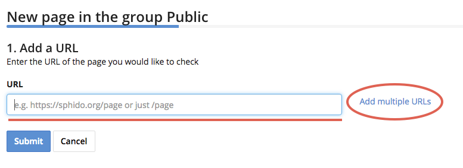
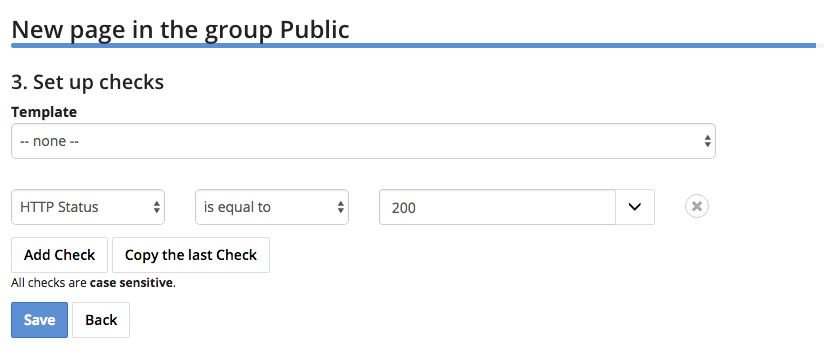

Add Page
========

1. Click on the project you'd like to manage.

2. Click on plus icon

.. image:: add-page.png
   :alt: Add Page
   :align: center

3. Enter the URL of the page you'd like to monitor and Name your check. If you'd
like to create multiple checks at the same time, click *Add more URLs*.

4. Enter the **Name** of your check and select whether you'd like to autocreate
checks for forms on your webpage.

.. image:: enter-name.png
   :alt: Enter name
   :align: center

5. Enter your check parameters.

Get more information :doc:`about checks </checks>`

6. Click **Save**
