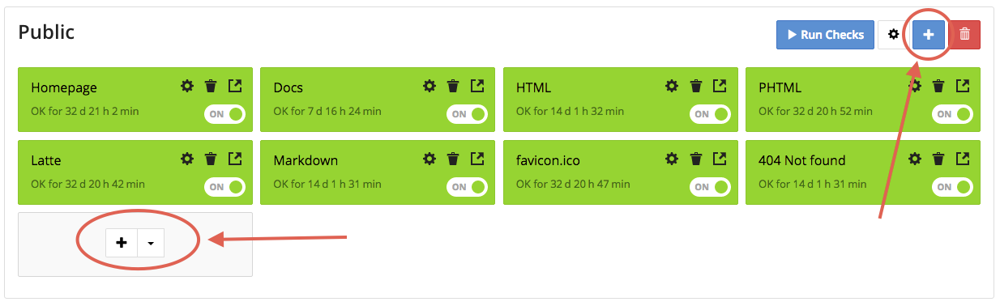
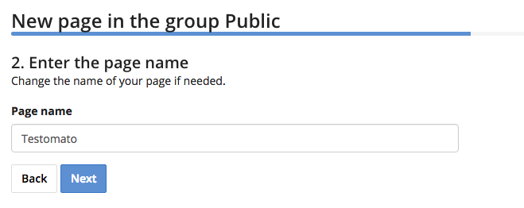

Add Page
========

1. Click on the project you'd like to manage.

2. Click on plus icon

3. Enter the URL of the page you'd like to monitor and Name your check. If you'd
like to create multiple checks at the same time, click *Add more URLs*.

4. Enter the **Name** of your check and select whether you'd like to autocreate
checks for forms on your webpage.

5. Enter your check parameters.

Get more information :doc:`about checks </checks>`

6. Click **Save**
