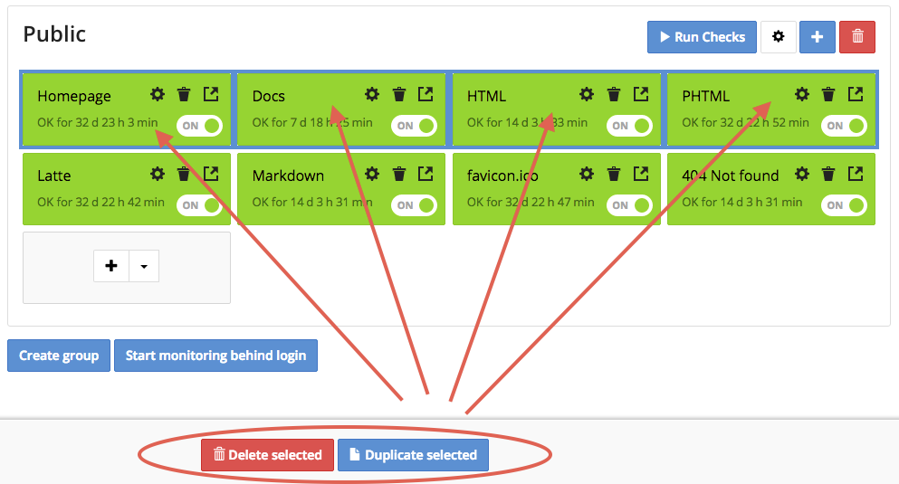

Duplicate pages
===============

You can duplicate or delete multiple checks at a time from your project dashboard.

Here's how to do it:

1. Click on the project you'd like to view.

2. Hold Shift (on Macs Cmd) and select the boxes you'd like to duplicate or delete.

3. Click **Duplicate** or **Delete** buttons that appear at the bottom of the page.

4. Click **OK to confirm**. All new checks will be copied as disabled checks.
