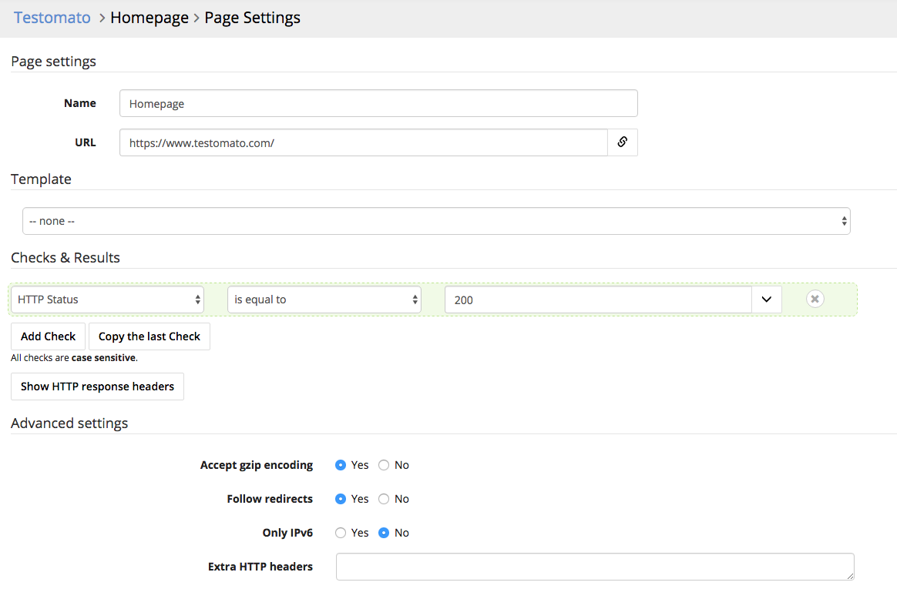

Edit Page
=========

You can change the configuration of a page or remove a page from a your project dashboard.

Here's how to edit a check:

1. Click on the project you'd like to view.

2. Find the check box you would like to edit and click the gear icon.

.. image:: edit.png
   :alt: Edit pages
   :align: center

3. Change page settings and hit save

4. Click **Save**.

Read more information about :doc:`Checks & Results </checks>`.
