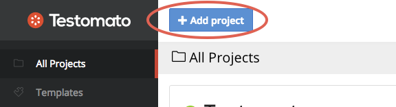
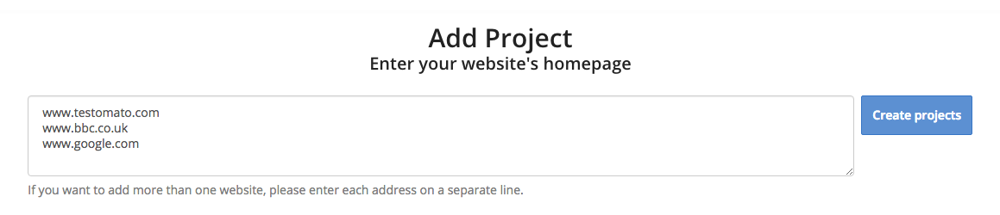

Add Project
===========

You can visit `Add Project <https://www.testomato.com/project/create>`_ page or
Click **+Add project** in the top left corner.

1. Enter homepage URL

2. Click **Create project**. Your new project will be created and added to your main dashboard.

.. warning:: You can create multiple projects at once by putting each new URL on a separate line.

Pre-configured Pages Check
--------------------------

1. The first check we add to the suite is your homepage (this is taken from the
   URL you add as your project).

2. Then, Testomato analyzes your home page and ignores any links that take you
   away from this website (e.g. social links).

3. Next, we sort links by the length of the link text (e.g. About, Contact, Buy,
   etc.). We take the 8 shortest and add them to your dashboard with basic
   configuration.

4. We then add 3 more checks automatically:
   * 404 Not Found Error
   * Favicon
   * robots.txt

5. Finally, we create unconfigured checks for any forms we find on your homepage.
   These checks will appear as gray boxes in your project dashboard.
