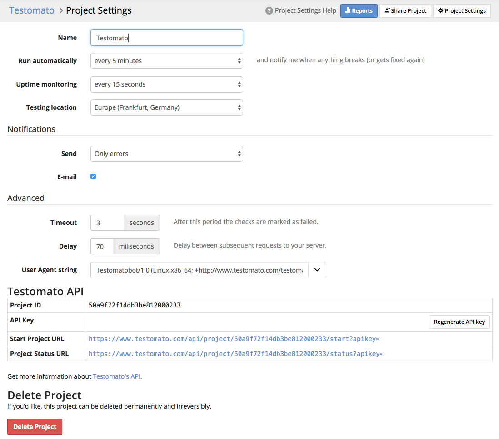

Project Settings
================

The following settings are available for projects:

* Name your project
* Select intervals for your checks to **Run automatically**.
* Set :doc:`Uptime monitoring </uptime/uptime-monitoring>` intervals or turn it off
* Select a **testing location**.
* Set whether or not you'd like to receive **Notifications** and severity of alerts.
* Set a **Timeout** speed for your tests.
* **Delay** the time between subsequent tests that run in your project.
* Select a different **User Agent string**.
* **Delete** a project permanently.

