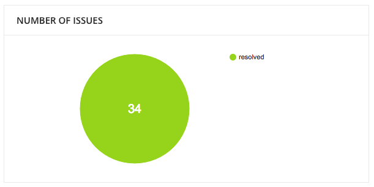
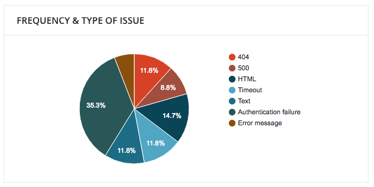
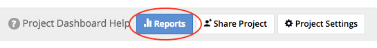
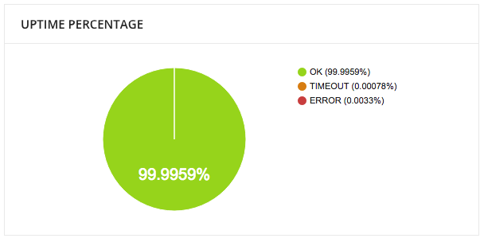
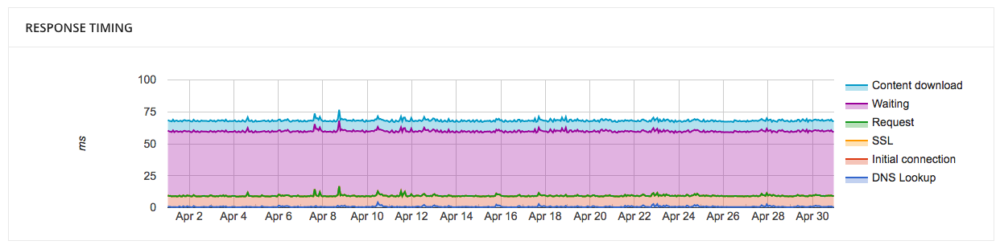
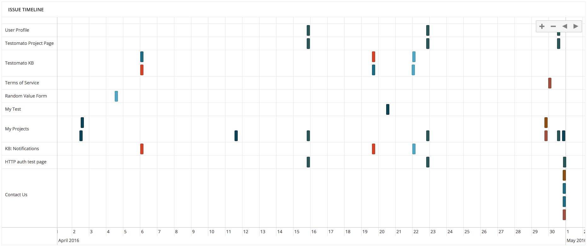

What's in Reports?
==================
Testomato provides in-depth Reports for monitoring your projects.
We collect data that gives you more insight to help you find the
reason behind errors on your website.

Here’s a quick guide to our Reports and how to navigate them.

Reports are split into 6 sections:

* **Number of Issues** - The number of problems found on your website.

* **Issue Type Frequency** - The frequency of different errors found.

* **Issue Duration** - The time it took for an issue to be resolved.

* **Uptime Percentage** - The uptime percentage of your website for the following: OK, TIMEOUT, or ERROR.

* **Response Timing** - The amount of time it took for each phase of a page to load.

* **Issues Timeline** - A timeline showing when and where issues occurred.
You can select a predefined date range or set your own custom range to see data for different time periods in your reports.

Predefined date ranges include:

* Today - Data available for the selected calendar date.
* Yesterday - Data for the previous calendar date.
* This Week - Data available from Monday up until the current calendar date.
* Last Week - Data for Monday through Sunday of the previous calendar week.
* This Month - Data available from the first day of the month through the current date.
* Last Month - Data from the first to the last day of the previous calendar month.
