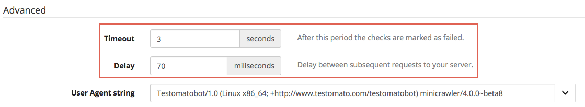
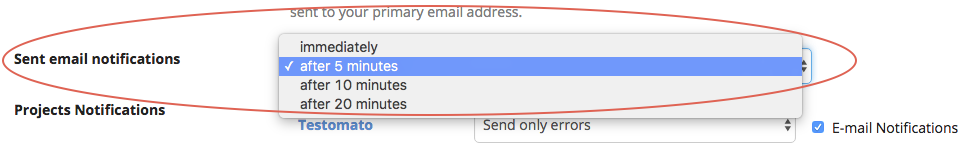

What's Causing My Timeouts?
===========================

When outages are short (i.e. under 2 minutes), they are most likely caused by
a temporary issue somewhere between Testomatobot and your site. The cause of
this type of issue can be hard to determine.

This article will teach you about timeout results you may see in Reports and
where to start when trying to discover the exact source of a problem.

.. contents:: In this article
   :local:
   :depth: 1

Timeouts
--------

Timeouts **make up over 70% of the short incidents** we see reported by Testomato.

Most of the time, timeouts occur during peak hours when you have high visitor
traffic. However, another common reason is that your hosting service or server
reaches aconcurrent connection limit.

A concurrent connection is how many people are calling a task on your website
at one time. When someone clicks on a page, and then submits a form on your
website, these are considered two separate consecutive actions that require
two separate consecutive connections.

However, when 50 people click on the same page at the same time, these are
considered 50 concurrent connections. After the page loads, the connection
closes.

Hosting services often limit the number of concurrent connections to a site
to avoid an overload of processes, or how many visitors can simultaneously
connect to your hosting account at one time.

Testomato opens a concurrent connection for every check that it runs on your
site, and in some cases this can cause a page to be unavailable when we try
to test it.

What can you do to avoid this problem?

**We have a few suggestions**:

Increase your timeout period and delay
~~~~~~~~~~~~~~~~~~~~~~~~~~~~~~~~~~~~~~

Set a longer **delay period** between subsequent checks to avoid an overlap
from Testomato and increase **Timeout settings**.

To adjust these periods, open your project and then click to
**Project Settings**

.. image:: /uptime/project-settings.png
   :alt: Project Settings
   :align: center

and scroll down to **Advanced options**:

Change email notifications delay
~~~~~~~~~~~~~~~~~~~~~~~~~~~~~~~~

Delay your email notifications to avoid receiving alerts about short-term issues.
You can delay your notifications from your account `Instant Notifications
Settings <https://www.testomato.com/user/notifications-settings>`_ and change
 *Sent email notifications* settings:

HTTP Status Codes
-----------------
Roughly 15% of short incidents are related to server responses with error code.
Many of these can be general, which can make it harder for you to track down
the error on your website.

Here’s a quick look at the three most common status codes we see in Testomato
and possible reasons you might see them:

* **503 Service Unavailable** – Your backend was unable to handle all the
  requests made to your site. As a result, your proxy will start returning
  503 errors.
* **500 Internal Server Error** – This is a very general server error, so the
  best place to check for more clues about the problem is your application log.
  These errors are often connected with availability issues and timeouts
  related to your database server, or other important services your application
  needs to run.
* **502 Bad Gateway Error** – These errors are usually protocol problems between
  your proxy and backend server due to maintenance.

PHP Fatal Error – Out of Memory
-------------------------------

About 5% of the reported incidents in Testomato are related to PHP errors. You
can find full details about each error in your Issues Timeline located in your
project’s  Reports tab.

However, the PHP error we see the most in Testomato is  Fatal Error: Out Of
Memory. This is a particularly common if your application processes large
amounts of data.

This message means you’re trying to load more memory than you have available in
the system.

We suggest evaluating the other processes that run on your server and  how much
memory they consume. Increase your system memory accordingly, and then optimize
or remove greedy programs (like your database) to another server.

If you’re running on `Apache <https://httpd.apache.org/>`_, you might want to
take a second look at how its configured. Try getting rid of unnecessary
modules, set lower MaxClients, and limit MaxRequestsPerChild to prevent memory
leaks. You could also try migrating to a web server with better memory
management, such as `nginx <http://nginx.org/en/>`_ or
`IIS <http://www.iis.net/>`_.

Download Errors
---------------

Download errors are usually caused by Network, SSL, or DNS problems.

Let’s take a look at the most common errors we send to Testomato users:

* **Failed to connect to host (Connection refused)**: This message means that
  Testomatobot was unable to connect to your server and is getting refused by
  a firewall. If you filter your traffic, check your firewall configuration and
  be sure to allow access to Testomatobot’s  IP addresses.
* **Downloading content failed (Connection reset by peer)**: This message means
  the connection was terminated before the page could finish downloading. This
  is often related to maintenance work on your server, such as a software
  upgrade or a server restart by the server administrator. It could also be
  caused by general server failures like segmentation faults.
* **Failed to connect to host (No route to host)**: This message means there was
  a routing problem and Testomatobot was unable to connect to your server.
  Unfortunately, this could occur anywhere between your server
  and `Testomato <https://www.testomato.com>`_, but the good news is that this
  is usually related to a short-term network problem.
